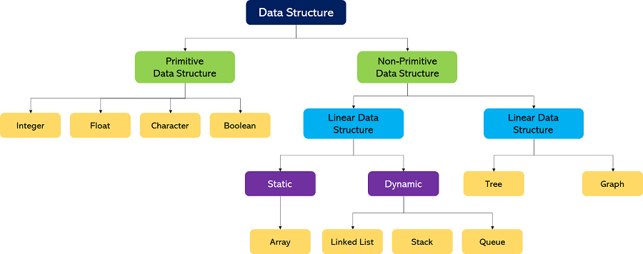

# Types of algorithms

<figure><figcaption>
Data structure <a href="https://www.javatpoint.com/data-structure-introduction">1)</a>
</figcaption></figure>

검색

* 순차/선형 검색
* 이진 검색
* 해시탐색

정렬

* 선택
* 삽입
* 병합
* 퀵
* 버블

그래프

* 너비우선 BFS
* 깊이우선 DFS
* 최단경로
* 다익스트라
* 최소신장트리
* 크루스칼
* 프림/개선된 프림

#### 문제 해결전략

재귀

* 파보나치 수열
* 최대공약수
* 하노이의 탑

동적계획법

* 상향식 접근
* 메모이제이션

분할&정복

탐욕 Greedy

백트래킹
