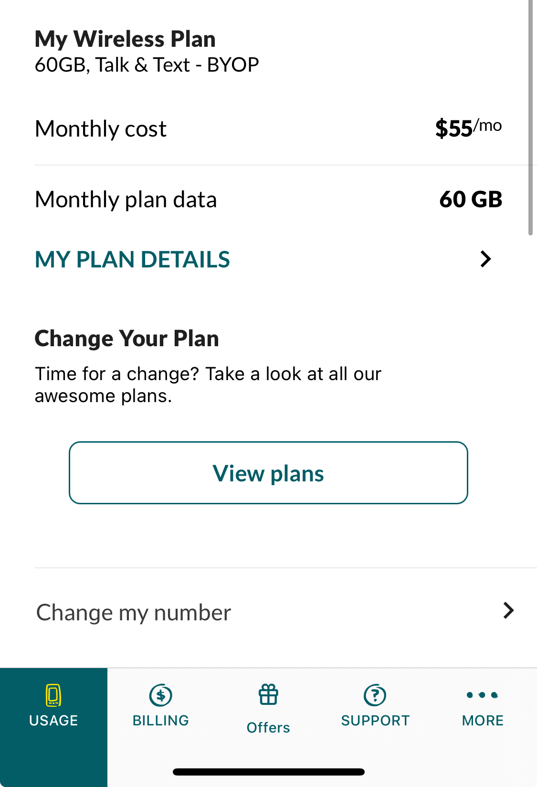

# 캐나다 워홀 휴대폰 eSIM: 수퍼셀로 캐나다 유심 준비 완료!

캐나다로 출국하기 전에 여러 행정 처리가 필요했는데 예를 들면 집을 계약하고 나서 필요한 유틸리티 계정 생성이나 테넌트 보험, 그리고 운전 면허증 교환을 위한 Service Ontario 예약 등이 있다. 이런 행정 처리에는 현지 번호가 필수였고, 출국까지 시간도 별로 남지 않았고 너무 당황스러웠지만 빠르게 수퍼셀을 통해 캐나다 유심 서비스를 신청하게 되었다.

[https://pf.kakao.com/\_xlvhCT](https://pf.kakao.com/_xlvhCT)

## 수퍼셀을 알게 된 경로

<figure><figcaption></figcaption></figure>

다음카페 캐스모에서 수퍼셀을 알게되었는데 이 가격을 보자마자 상담을 안 할 수 없었다. 그리고 다양한 요금제를 한 번에 상담할 수 있다는 점이 매우 편해보였고 무엇보다 바로 개통이 가능한 것 같아서 바로 신청했다. 여러 대리점에서 개별적으로 상담을 받는 것보다 수퍼셀을 통해 한번에 요금제를 비교하고 선택할 수 있어서 좋고 이 과정에서 캐나다 통신사와 유심에 대한 여러 가지 옵션도 함께 알 수 있어서 나에게 필요한 걸 찾기 쉬웠다.

## 수퍼셀 가입 과정

<figure><figcaption></figcaption></figure>

수퍼셀 가입 과정은 정말 간단했다. 통신사와 요금제를 선택하고 위 내용을 웹사이트에 입력해서 신청하고, 필요한 서류를 제출하는 방식이었으며, 가입 후 바로 통신사 앱을 깔고 들어가보니 회선이 생겼다! 덕분에 캐나다에 도착하기 전에 모든 행정적인 준비가 끝나 있었고, 현지에서 필요한 모든 서비스를 바로 시작할 수 있었습니다. 당일에도 바로 개통이 가능했다. 이중에서 가장 맘에 드는 내용은 번호선택 부분.. 별건 아니지만 그래도 한국에서 사용하는 뒷자리 그대로 사용할 수 있어서 정말 좋았다. 당일에 모든 절차를 온라인으로 진행해서 개통했기 때문에 캐나다에 도착하기 전에 행정 처리를 거의 완료할 수 있었다. 내가 선택한 방식은 캐나다 eSIM 방식으로, 별도의 SIM 카드 없이 핸드폰에 데이터를 다운로드받아 사용할 수 있기 때문에 편리하게 바로 개통이 가능했다. 또한, eSIM이다보니 캐나다 유심을 사용할 때처럼 번거롭게 SIM 카드를 교체할 필요도 없었다.

<figure><figcaption></figcaption></figure>

나는 Fido BYOD 60기가 짜리로 가입했다. 가입하기 전에 실제로 Fido 사이트 들어가서 요금제와 가격을 확인해봤는데 가격이 동일했기 때문에 한국어 서포트를 받기 위해 수퍼셀에서 캐나다 유심을 구입하기로 결정했다.

## 수퍼셀 선택의 장점

<figure><figcaption></figcaption></figure>

* **간편한 가입 절차**: 온라인으로 가입을 마친 후, 빠르게 캐나다 eSIM을 활성화할 수 있어 한국에서 모든 행정 처리가 완료되었다.
* **다양한 요금제 상담**: 여러 대리점에서 다양한 요금제를 비교할 수 있어 가장 적합한 캐나다 유심 요금제를 선택할 수 있었다.
* **빠른 서비스**:  한국에서 현지 변호가 필요했는데 문의 하자마자 빠른 상담과 답장으로 eSIM 덕분에 바로 개통해서 번호 이용이 가능했다.

당일에 빠른 현지 캐나다 번호 개통을 원한다면 수퍼셀 추천!

<figure><figcaption>
<a href="https://pf.kakao.com/_xlvhCT">https://pf.kakao.com/_xlvhCT</a>
</figcaption></figure>

