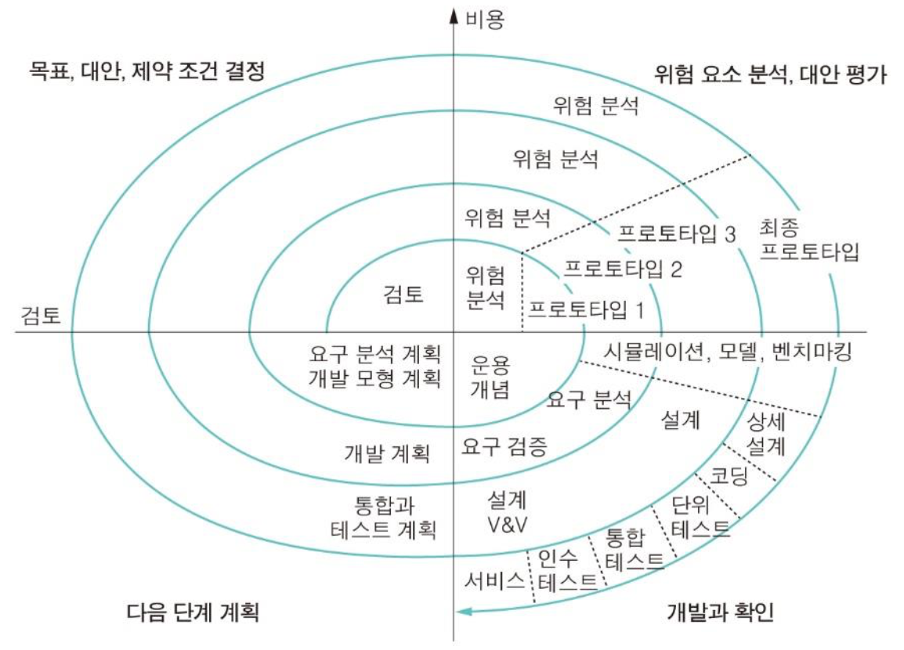

# 소프트웨어 프로세스 Software process

1. 소프트웨어 명세: 요구사항
2. 소프트웨어 개발: 실제 개발
3. 소프트웨어 검증: validation
4. 소프트웨어 진화: 유지보수

***

### 폭포수(워터폴) 모델

<figure><figcaption>
Waterfall process <a href="https://atoz-develop.tistory.com/entry/%EC%86%8C%ED%94%84%ED%8A%B8%EC%9B%A8%EC%96%B4-%EA%B0%9C%EB%B0%9C-%ED%94%84%EB%A1%9C%EC%84%B8%EC%8A%A4-%EB%AA%A8%EB%8D%B8-%ED%8F%AD%ED%8F%AC%EC%88%98-%EB%AA%A8%EB%8D%B8Waterfall-Model">1)</a>
</figcaption></figure>

**특징**

* 고전적인 소프트웨어 생명주기
* 한방향으로 진행됨
* 수정을 위한 재작업은 불가피함

| 장점                         | 단점                    |
| -------------------------- | --------------------- |
| 선형 모델로 단순하고 이해 쉬움          | 요구사항을 완벽히 정의 필요       |
| 단계별 정형화된 접근 방법과 체계적 문서화 가능 | 시스템 동작은 후반에 확인할 수 있음  |
| 프로젝트 진행 상황 명확히 파악 가능       | 대형 프로젝트에 적용하기 어려움     |
|                            | 문서화 노력이 지나침           |
|                            | 위험 분석 결여, 일정 지연 가능성 큼 |

1. 타당성 조사
   1. 투입 비용 대비 이익 평가
      1. 목표 충족
      2. 비용 대비 수익 효과
      3. 정해진 시간 안에 현재 기술 수준으로 개발 가능성
      4. 운영 및 사용 타당성과 다른 시스템과의 연동 가능성 판다
   2. 시간적 제약과 정신적 압박 존재
   3. 타당성 보고서
      1. 문제 정의
      2. 기술/경제적 타당성
      3. 해결 방안과 기대 효과
      4. 비용과 인도 날짜
2. 요구 분석과 명세
   1. 문제 해결을 위한 시스템이 갖춰야하는 조건이나 능력
   2. 요구사항 명세서 (Software Requirement Specification Document)으로 소통
      1. 시스템의 목적과 범위
      2. 기능적 요구사항, 비기능적 요구사항
      3. 기타 제약 조건 등
3. 설계와 명세
   1. 요구사항을 구현 작업에 맞게 변경
   2. 아키텍쳐, 인터페이스, 프로그램 설계로 구분
   3. 전통적, 객체지향 설계 방법 중 맞는 것을 선택
4. 코딩과 단위 테스트
   1. 설계 결과를 프로그램으로 작성
   2. 구현된 모듈이 명세서를 만족하는지 테스트
   3. 고려사항
      1. 레이아웃, 주석, 변수/함수 네이밍
      2. 테스트 계획 작성, 테스트 방법, 테스트 수준 결정
      3. 코드 인스펙션 (코드 리뷰)
5. 통합과 시스템 테스트
   1. 통합 테스트: 모듈들을 통합하여 점증적으로 시스템 구축
   2. 시스템 테스트: 모든 모듈이 통합된 후 최종적으로 완성된 시스템이 요구사항 만족 여부 확인
   3. 테스트
      1. 알파 테스트
         1. 일반 소프트웨어: QA팀이 먼저 테스트를 한 후 베타 버전을 릴리즈
         2. 주문형 소프트웨어: 실제 production 환경에서 개발자와 고객이 테스트하면서 인수 동의가 이루어질  때까지 수행
      2. 베타 테스트
         1. 고객의 실제 사용 환경에서 수행
         2. 일반 소프트웨어의 제품 출시 전 target 고객으로 부터 미리 제품 평가
6. 인도
   1. 고객에게 소프트웨어 배포
   2. 소프트웨어 폐기 전까지 수정 및 보완 활동
   3. 유지보수 노력이 적게 드는 소프트웨어 개발 중요
7. 유지보수
   1. 수정 유지보수
      1. 오류 수정
   2. 적용 유지보수
      1. 변경된 환경에 적응시키기 위한 것
   3. 완전 유지보수
      1. 기능 개선 및 서능 향상을 위한 것
      2. 비용 및 빈도가 높음
   4. 예방 유지보수
      1. 미래 유지보수성을 높이기 위한

***

### 반복 진화형(애자일) 모델

<figure><figcaption>
Iterative process <a href="https://atoz-develop.tistory.com/entry/%EC%86%8C%ED%94%84%ED%8A%B8%EC%9B%A8%EC%96%B4-%EA%B0%9C%EB%B0%9C-%ED%94%84%EB%A1%9C%EC%84%B8%EC%8A%A4-%EB%B0%98%EB%B3%B5%EC%A0%81-%EB%AA%A8%EB%8D%B8%EC%9D%98-%EC%A2%85%EB%A5%98%EC%99%80-%EC%B0%A8%EC%9D%B4%EC%A0%90">2)</a>
</figcaption></figure>

초기 버젼을 만들고 요구사항을 정제하여 새로운 버젼을 개발하는 작업을 반복하여 시스템을 완성해 나가는 방식이다. 즉, 개발을 진행하면서 요구사항의 변화를 수용하는 과정이 필요하다. 명확히 이해할 수 없는 새로운 기술을 적용할 때나 한꺼번에 모든 기능을 포함해 인도해야하는 경우 채택할 수 있는 방법론이다.

* 분명한 요구사항과 시스템 범위 정하는 노력 필요
* 프로토타이핑을 통해 요구사항 보완
* 최종 버젼이 나온 후 유지보수 단계 들어감

| 장점                                                | 단점                                                   |
| ------------------------------------------------- | ---------------------------------------------------- |
| 요구사항이 완성되지 못한 경우에도 초기 버전을 만들고 점차적으로 명확한 요구사항을 도출함 | 관리적 관점에서 개발 비용의 예상이 힘들고 재작업이 잦아지면 종료 시점이 늦춰질 가능성이  큼 |
|                                                   | 공학점 관점에서 잦은 수정은 소프트웨어 구조에 악영향을 주어 문제 생길 수 있음         |

### 프로토타이핑 방법

<figure><figcaption>
Prototyping <a href="https://atoz-develop.tistory.com/entry/%EC%86%8C%ED%94%84%ED%8A%B8%EC%9B%A8%EC%96%B4-%EA%B0%9C%EB%B0%9C-%ED%94%84%EB%A1%9C%EC%84%B8%EC%8A%A4-%EB%B0%98%EB%B3%B5%EC%A0%81-%EB%AA%A8%EB%8D%B8%EC%9D%98-%EC%A2%85%EB%A5%98%EC%99%80-%EC%B0%A8%EC%9D%B4%EC%A0%90">3)</a>
</figcaption></figure>

* throwaway prototyping
  * 고객과의 의사소통 수단으로 사용
  * 요구사항이 확인되면 프로토타입을 버리고 새로 시스템 개발
* evolutionary prototyping
  * 잘 알고 있는 부분부터 시작하여 계속적으로 발전시켜 완제품으로 만드는 방법

| 장점                                        | 단점                           |
| ----------------------------------------- | ---------------------------- |
| 프로젝트의 실현 가능성, 소프트웨어의 개발 가능성을 판단할 수 있음     | 문서화가 힘들며 관리자는 진적 사항을 제어하기 힘듦 |
| 개발자와 사용자 간의 의사소통 명확                       |                              |
| 기능적 요구사항 외에도 성능이나 유용성 등 품질 요구를 분명히 할 수 있음 |                              |
| 시스템을 미리 사용함으로써 사용자 교육 효과                  |                              |
| 개발 단계에서 유지보수가 일어나는 효과                     |                              |

### 점진적 모델

<figure><figcaption>
Incremental Model <a href="https://atoz-develop.tistory.com/entry/%EC%86%8C%ED%94%84%ED%8A%B8%EC%9B%A8%EC%96%B4-%EA%B0%9C%EB%B0%9C-%ED%94%84%EB%A1%9C%EC%84%B8%EC%8A%A4-%EB%B0%98%EB%B3%B5%EC%A0%81-%EB%AA%A8%EB%8D%B8%EC%9D%98-%EC%A2%85%EB%A5%98%EC%99%80-%EC%B0%A8%EC%9D%B4%EC%A0%90">4)</a>
</figcaption></figure>

중요도에 따라 요구사항을 나누고 작업 순서를 정한다. 중요한 요구사항을 먼저 개발한 후 조금씩 개발하면서 여러 번의 릴리즈를 한다. 여러 개의 모듈들로 분해하고 각각 점증적으로 개발하여 인도한다.

* 선형 순차 모델(워터폴 모델)을 여러번 적용하여 그 결과를 조합
* 각 모듈 증분(increment)
* 핵심 모듈 선 개발 후 인도

| 장점                                   | 단점                         |
| ------------------------------------ | -------------------------- |
| 중요한 증분이 먼저 개발되므로 사용자는 시스템을 이른 시기에 사용 | 기능적으로 분해하기 어려울 수 있음        |
| 릴리즈 방식이 요구사항 변화에 대응하기 용이함            | 적당한 크기의 증분을 나누기 어려움        |
| 증분들이 점차로 규모와 기능이 축소되어 관리가 어렵지 않음     | 증분을 개발하기 전에 명확한 요구사항 정의 필요 |
| 먼저 개발되는 중요 부분이 반복적으로 테스트됨            |                            |

### 나선형 모델

<figure><figcaption>
Spiral Model <a href="https://atoz-develop.tistory.com/entry/%EC%86%8C%ED%94%84%ED%8A%B8%EC%9B%A8%EC%96%B4-%EA%B0%9C%EB%B0%9C-%ED%94%84%EB%A1%9C%EC%84%B8%EC%8A%A4-%EB%82%98%EC%84%A0%ED%98%95-%EB%AA%A8%EB%8D%B8%EA%B3%BC-V-%EB%AA%A8%EB%8D%B8">5)</a>
</figcaption></figure>

반복 진화형 모델의 확정 버젼이다. 전체 생명주기의 위험 분석과 프로토타이핑을 계획하고 사용하여 위험을 최소화하려는 목적이다. 각 단계 별로 목표와 대안, 대안의 평가, 개발과 확인, 다음 단계 계획으로 구성된다.

위험관리를 지원하는 프로세스의 프레임워크이다. 위험관리에는 비용은 들지만 가치가 있다. (위험이란 프로젝트 수행이나 제품 품질에 악영향을 주는 잠재 요소) 실험적이고 복잡한 대형 프로젝트에 적합하다.

| 장점                                  | 단점                |
| ----------------------------------- | ----------------- |
| 대형 프로젝트에서 위험 관리를 통해 성공 가능성을 높일 수 있음 | 경험이 부족하여 충분히 검증 X |
| 프로젝트 특성이나 개발 조직에 맞게 변형될 수 있음        | 모델 자체가 복잡         |
|                                     | 프로젝트 관리 어려움       |

### V 모델

<figure><figcaption>
V model <a href="https://velog.io/@whitebear/V%EB%AA%A8%EB%8D%B8%EC%9D%84-%EC%95%8C%EC%95%84%EB%B3%B4%EC%9E%90">6)</a>
</figcaption></figure>

각 개발 단계의 작업을 확인하기 위한 상응하는 테스트 작업을 수행한다. 요구사항과 설계 결과를 테스트 하는 것이다. 워터폴 모델에 비해 반복과 재처리 과정이 명확하다. 테스트 작업을 단계별로 구분하므로 책임이 명확해진다.

***

### 애자일 방법

변화를 수용하고 협업을 강조하며 제품의 빠른 인도를 강조하는 반복적 개발 방법이다. 문서화 작업보다는 코드를 강조한다. 문서보다는 소프트웨어 자체를 중요시 한다. 요구사항의 변화는 불가피하며 이것에 대응하는 것이 현실적이다. 기존의 개발 프로세는 설계 기간이 길며 재작업시 오버헤드가 크다. 환경의 빠른 변화에 대응하고 빠른 인도가 중요하다. 비즈니스 시스템이나 커머스에 적합하다.

[Agile Manifesto 애자일 선언문](https://agilemanifesto.org/)

<figure><figcaption>
Extreme programming XP
</figcaption></figure>

XP는 대표적인 애자일 방법 중 하나

* 작고 빈번한 릴리스, 빠른 피드객과 지속적 개선
* 고객도 개발 팀의 일원
* 프로세스 중심이 아닌 사람 중심의 작업과 페어 프로그래밍
* 단순한 설계와 테스트 선행 개발
* 코드 품질 개선을 위한 리팩토링

Best practices를 적극적으로 적용할 것

#### 페어 프로그래밍

* 코드에 대한 책임 공유
* 비형식적 검토 수행
* 코드 개선을 위한 리팩토링 장려
* 생산성 떨어지지 않음

#### TDD 테스트 선행 개발

* TC를 먼저 작성하고 이것을 통과하는 코드를 만들 것
* 유저 스토리가 테스크로 분해됨
* 기존 TC 재사용, 통합 테스트를 강조하며 오류가 유입되지 않게 해야함

#### 스크럼

애자일 개발 과정 관리에 초점을 둔 프로젝트 관리 프레임워크

스크럼 프로세스는 계획과 스프린트의 반복으로 이루어짐

프로젝트 계획(백로그)

스프린트 사이클
