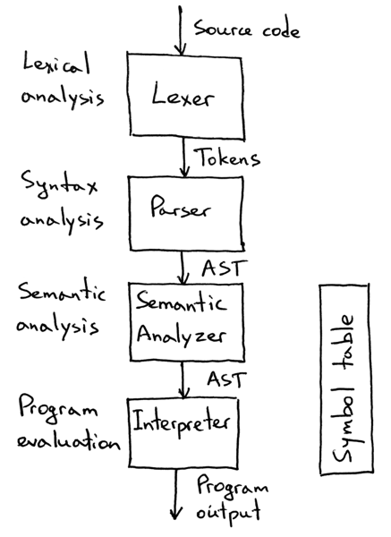

# 인터프리터 Interpreter

인터프리터는 고급 언어로 작성된 소스 프로그램의 코드를 한 줄 한 줄 읽으면서 문장 단위로 해석하여 바로 실행하는 방법으로 대표적으로 자바스크립트(인터프리터 또는 JIT), 파이썬 등이 인터프리터 방법을 이용하고 있다.&#x20;

컴파일러와 다르게 인터프리터는 실행 파일이 생성되지 않아도 프로그램이 바로 실행될 수 있다. 따라서, 바로 실행되기 때문에 에러가 발생하면 확인하고 바로 수정할 수 있다.

## 인터프리터 구현 과정

<figure><figcaption>
Semantic Analysis <a href="https://ruslanspivak.com/lsbasi-part13/">1)</a>
</figcaption></figure>

인터프리터가 구현되는 과정은 다음과 같다. 먼저, 원시 프로그램의 코드를 중간 코드인 바이트 코드로 변환한다. 바이트 코드로 변환하기 위해 분석 단계를 거치는데, 어휘를 문법적 단위로 나누기 위해 코드 한 줄을 각 토큰으로 분할한다. 그 이후 해당 토큰들을 파싱하여 구문을 분석하여 올바른 문법인지 확인하기 위해 분석(parse) 트리 즉, AST(추상 구문 트리)를 생성한다. 생성된 AST를 토대로 프로그램의 의미를 분석하여 타입의 유효성을 검사한다. 에러가 없다면 바이트 코드를 생성하고 이렇게 만들어진 바이트 코드를 인터프리터 엔진이 해석하여 기계어로 변환하고 해당 기계어를 CPU가 읽고 연산을 진행하여 실행한다.
