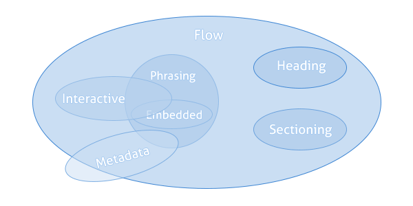

# 문서객체모델 Document Object Model

### 시맨틱 Semantic

코드 뿐만 아니라 코드 그룹에 흐름을 쉽게 이해할 수 있도록 앞뒤로 연결지어 시맨틱하게 작성하자

```javascript
//함수 이름에 시맨틱을 부여하면 함수 블록의 코드를 읽지 않아도 함수 기능을 짐작 가능
//이름만 봐도 값을 리턴하겠구나

const values = [1, 2];
const getValue =  (index) => {
    return values[index]
};
const value = getValue(1);
console.log(value); // 2
```

```
Semantic + Nuance 

모자를 쓰다 vs 글을 쓰다 //쓰다라는 단어는 같지만, 행동이 아예 다름

//시멘틱 뿐만 아니라 뉘앙스(목적)까지 제한해서 단순화하자 -> 원하는 것이 무엇인지 정리하자
```


### 인터페이스 Interface

인터페이스는 만들어진 DOM 트리에 접근/조작하기 위함이고, 가장 최상단에 Document

```javascript
document.getElementById("id"); //돔에 접근하고 조작할 수 있는 인터페이스
```

<figure><figcaption><p>돔 트리 DOM Tree <a href="http://staff.washington.edu/weller/css/DOM1.html">1)</a></p></figcaption></figure>


자바스크립트는 사전 처리를 하지 않아도 이미 빌트인 되어 있기 때문에 DOM 인터페이스를 이용할 수 있다. DOM은 오브젝트이고, 자바스크립트도 오브젝트 기반이기 때문에 가능한 것 같다...?


```javascript
//객체는 프로퍼티를 갖고 있으며, 프로퍼티는 key:value 형태이고 
//프로퍼티는 속성 attribute를 가짐 
//attribute는 프로퍼티가 어떻게 사용할 수 있는지 i.e. Writable 등
//프로퍼티에는 Primitive value, object, function을 넣을 수 있음

const obj = {
    key: value,
}
```

함수는 정적 스코프, 실행 콘텍스트를 펼침

```javascript
const arr = ["apple", "banana"]; //new 키워드를 사용하지 않아도 인스턴스 생성
const arr1 = new Arrary ("apple", "banana");

const obj = arr.join(","); //Array 메소드 apple,banana
const str = obj.split(","); //String 메소드 ["apple", "banana"]
```

```javascript
//func vs method 

Array.isArray() //함수 오브젝트의 프로퍼티 오브젝트.function()
Array.prototype.concat() //메소드 prototype, __proto__와 연결되어 있기 때문에
```

함수는 인스턴스에 포함되지 않는다?

함수는 callable

Global Object는 `Window.location` 과 같이 불리는 것 이고 자바스크립트에서 만든게 아님


실행 콘텍스트

렉시컬 호출된 함수에 작성된 변수, 파라미터 등 모든 것을 {key: value} 형태로 설정 이 안에서 함수 블록의 코드 실행

외부 렉시컬 함수 외부에 있는 변수/함수를 참조했다면 여기에 설정 -> 클로저 (실행 콘텍스트가 펼쳐진 함수 기준으로 함수 밖은 클로저)


스코프

```html
<!-- Element의 범위를 나타내기 위해 시작과 마침 태그를 이용해서 표현 -->
<!-- tagName와 nodeName 같음 -->
<!-- DOM은 Element 기준 -->

<p>content</p>
```

aria 관련 프로퍼티는 접근성 관련


XHTML, HTML 4.5는 마크업 중심으로 자바스크립트가 필요 없었으나,

HTML 5는 애플리케이션 중심으로 자바스크립트가 필요해졌다 -> Element 뿐만아니라 api 들도 추가됨

HTML은 콘텐츠를 제공하기 위함, 표현은 CSS 역할

```html
<!-- 아웃라인을 잘 그려보자 -->

<h1>1. title</h1>
<h2>1-1. title</h2>
```


```html
<!-- section은 heading과 footer를 포함할 수 있고 하나의 그룹이라고 봐도 되지 않을까? -->

<section> 
    article, aside, nav, section이 포함될 수 있다.
    메인 콘텐츠와 관련이 있어야한다.
    <aside> 
        광고와 같이 메인과 관련이 없는 것
    </aside>
    <article> 
        메인 콘텐츠가 아닌 것의 영역을 정의할 때 사용할 수 있다. 
        위젯 또는 리뷰에 사용할 수 있음
    </article>
</section>

```


<figure><figcaption><p>Element Categories <a href="https://schoolsofweb.com/html-content-models/">2)</a></p></figcaption></figure>

Element들은 카테고리에 속해있을 수 있다


```html
<!-- option이 연속된 경우 마침 태그를 작성하지 않아도 됨, 가능한 케이스가 있다 -->

<select id="drop-down" size=2>
    <option> 1번
    <option> 2번
</select>
```

HTMLElement

프로퍼티 메소드가 포함될 수 있음

Node 옵션 엘리먼트에 설정될 수 있음


문장으로 요구사항을 만들어보자 (시나리오 짜기)

sudo코드로 진행봐도 괜찮을 것 같다

사용자 중심 스토리 태스크를 구성해보자

그 이후에 개발을 고민하자


자바스크립트는 ECMASciprt 스펙이다

스펙이 실무 기준이다


DOM은 동적으로 콘텐츠 제공, 사용자와 인터렉션 할 수 있도록 접근 및 조작하기 위함이다

DOM의 인터페이스, 프로퍼티, 메소드를 잘 감 잡아보자


W3C World Wide Web Consortium

WHATWG DOM 스펙 작성 모든 것을 주관

Web Applications Working Group DOM확장, UI Event&#x20;


DOM은 버젼이 아닌 레벨을 이용함

DOM Living Standard

HTML Living Standard


