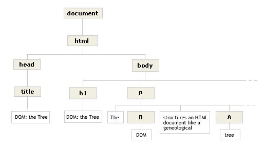

# 문서객체모델 Document Object Model

### 시맨틱 Semantic

코드 뿐만 아니라 코드 그룹에 흐름을 쉽게 이해할 수 있도록 앞뒤로 연결지어 시맨틱하게 작성하자

```javascript
//함수 이름에 시맨틱을 부여하면 함수 블록의 코드를 읽지 않아도 함수 기능을 짐작 가능
//이름만 봐도 값을 리턴하겠구나

const values = [1, 2];
const getValue =  (index) => {
    return values[index]
};
const value = getValue(1);
console.log(value); // 2
```

<pre><code><strong>Semantic + Nuance 
</strong>
모자를 쓰다 vs 글을 쓰다 //쓰다라는 단어는 같지만, 행동이 아예 다름

//시멘틱 뿐만 아니라 뉘앙스(목적)까지 제한해서 단순화하자 -> 원하는 것이 무엇인지 정리하자</code></pre>

DOM 인터페이스, 프로퍼티, 메소드를 다 외울 순 없으니 파악하는 방법을 알아보자..


### 인터페이스 Interface

인터페이스는 만들어진 DOM 트리에 접근/조작하기 위함이고, 가장 최상단에 Document

<figure><figcaption><p>돔 트D OM Tree <a href="http://staff.washington.edu/weller/css/DOM1.html">1)</a></p></figcaption></figure>
