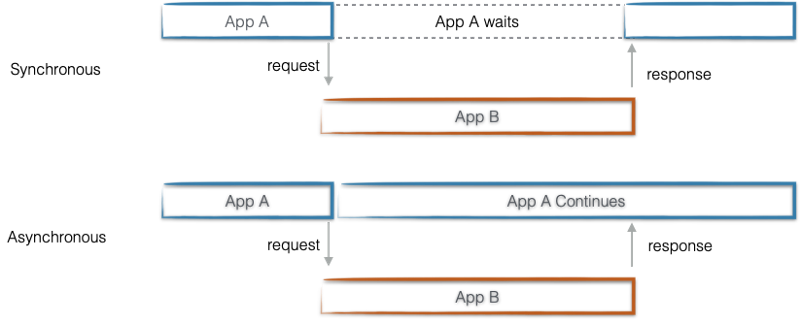

# Index

### 웹 브라우저

* [ ] 브라우저 랜더링
  * [ ] React 동작 방식
* [ ] CSR, SSR
* [ ] 웹 스토리지
  * [ ] 쿠키, 세션, 로컬
* [ ] http, https
* [ ] CORS, SOP
  * [ ] CSRF, XSS 설명 및 방어

###

### 네트워크 & 운영체제

* [ ] REST API
* [ ] 프로세스 vs 스레드

###

### 자바스크립트

* [ ] 자바스크립트에 대해서 아는대로 이야기해봐라
  * [ ] 싱글스레드
    * [ ] 비동기
      * [ ] 비동기 통신 AJAX 구현
      * [ ] Promise, async, await
      * [ ] HTML에서 자바스크립트 파일 위치 및 비동기 동작 defer, async , type=module
    * [ ] 자바스크립트 동작 방식
      * [ ] stack vs queue, 예시
  * [ ] 동적 타입 언어
  * [ ] 인터프리터
* [ ] 이벤트 버블링, 캡처링, 위임
* [ ] 호이스팅, var/let/const
* [ ] 실행 컨텍스트, 클로저
* [ ] 크로스 브라우징

###

### 리액트

* [ ] 리액트에 대해서 아는대로 설명해봐라
  * [ ] 랜더링 virtual DOM, 동작방식
    * [ ] 리액트 생명주기
      * [ ] mount, update, unmount
    * [ ] hooks가 뭔지, 어떻게 이용하는지
      * [ ] useState 비동기
      * [ ] useMemo, useCallback
      * [ ] useEffect
      * [ ] useRef
        * [ ] 제어 vs 비제어 컴포넌트?
    * [ ] 최적화 경험
      * [ ] 메모이제이션, useMemo, useCallback, React.memo
  * [ ] 상태 관리
    * [ ] zustand vs context API
    * [ ] redux cf) useReducer
      * [ ] props drilling 경험
  * [ ] 유저 인터페이스 라이브러리
    * [ ] 컴포넌트 설계 방식
      * [ ] MVC 모델 설명
    * [ ] 프레임워크 vs 라이브러리
  * [ ] 리액트 선택 이유
* [ ] 리액트 최신 버전 업데이트 사항 및 특징
* [ ] 라이브러리
  * [ ] react-query


### 경력

* [ ] 가장 최근에 해결한 기술 이슈
* [ ] 팀 내에서 어떤걸 기술적으로 제안해본 경험이 있는지?


### 개인

* [ ] 장단점은 어떤게 있는가
* [ ] 어떤 개발 스타일을 갖고 있는가
  * [ ] 개발 시 중요하게 생각하는 부분은 무엇인가
  * [ ] 클린코드란 무엇이라 생각하는가
* [ ] 어떤 역량을 키우고 싶은가?
* [ ] 향후 3-5년 뒤는 어떻게 되고 싶은가
* [ ] 어떤 동료들과 일하고 싶은가
  * [ ] 어떤 개발자가 되고 싶은가
* [ ] 어떤 개발 환경을 원하는지?

###

### 과제

* [ ] 어떻게 설계했는가
  * [ ] 왜 그렇게 설계했는가
* [ ] 과제하면서 가장 고려한 부분은 무엇인가
* [ ] 어려웠던게 있다면 어떤게 있었는지

###

### 타입스크립트

* [ ] interface vs type
* [ ] 타입스크립트 사용 이유
* [ ] 유틸 메소드
* [ ] super type vs sub type


<details>

<summary>Thoughts</summary>

## CORS(Cross-origin Resource Sharing)


교차 출처 리소스 공유는 동일한 URL이 아닌 다른 출처에서 데이터를 주고 받는 것을 허용하는 정책이다.&#x20;

**프로토콜**, **호스트**, **포트**가 모두 같아야 동일한 출처이다.


실제로 리액트 프로젝트를 하면서 CORS 이슈를 겪었는데, 이를 해결하기 위해 `package.json` 에서 `proxy` 설정으로 해결했다.

```javascript
//package.json

"proxy": "http://localhost:8888"
```


##

## CSR(Client Side Rendring) SSR(Server Side Rendering)

**CSR 동작**

1. 서버에서 HTML/CSS 리소스 다운 후 빈 HTML 노출
2. JS 다운로드
3. 동적으로 DOM 생성
4. 유저 인터렉션 가능

**SSR**

1. 서버에서 만들어진 HTML 파일을 다운로드 후 완성된 화면 노출
2. JS 다운로드
3. 유저 인터렉션 가능


진행했던 프로젝트는 커머스 비즈니스이기 때문에 SEO가 중요한 플랫폼이고 이를 위해 Next.js를 도입했다.


## REST API

REST(Representational State Transfer)는 서버와 통신할 때의 만든 하나의 인터페이스이다. 일관적인 인터페이스를 유지할 수 있다. 자원 기반으로 설계되기 때문에 말하려는 바를 메시지를 통해 쉽게 알 수 있다. 다만 HTTP Method가 한정적인 단점도 있다.

* 자원 Resource -> HTTP URI(Uniform Resource Identifier)
* 행위 Verb -> HTTP Method(POST, GET, PUT, DELETE)을 통해 자원의 CRUD 기능을 수행할 수 있다.
* 표현 Representations -> HTTP Message Pay Load

```
GET api/team
GET api/team/:id
POST api/team
PUT api/team
DELETE api/team
```

소문자로만, 하이픈(-)으로, 마지막에는 슬래시(/) 없이 그리고 행위를 포함하지 않는 방식 등으로 설계되어야 한다.&#x20;


**\*URI vs URL**


## 브라우저 저장소

두 저장소 `key: value` 형태의 문자열 string 값으로 저장한다.


**Cookie**

Cookie는 4KB로 작은 데이터를 저장할 수 있고, 서버와 통신한다. 쿠키는 주로 서버가 유저를 기억하기 위한 용도로 사용된다. HTTP 프로토콜은 stateless이기 때문에 `request > response`가 끝나고 나면 통신을 끊고 그 다음 통신을 해도 이전 내용을 기억할 수 없기 때문이다. (주로 사용자의 언어, 다크모드 등의 내용을 저장)


**Web Storage**

Web Storage는 Local, Session으로 나뉘어져 있다. 5MB 정도로 쿠키에 비해서 큰 데이터를 저장 할 수 있고, 서버로 전송되지 않는다. 굳이 서버로 전송할 필요가 없는 데이터라면 보안과 속도를 위해 이용하며, 웹 성능에 영향을 주지 않고 큰 데이터를 저장할 수 있다. **Local Storage**는 유효기간이 없지만, **Session Storage**는 창을 닫으면 초기화된다.[4)](https://geonlee.tistory.com/127)

실제로 프로젝트에서도 Local Storage를 사용했었고, 일회성 모달과 로그인 여부를 확인하기 위해 저장했다.


**Browser Cache**

Browser Cache는 브라우저에서 웹 리소스의 사본을 저장하는 방식으로 이미지, HTML, CSS, JS 등의 에셋이 있다. 서버와 클라이언트가 통신을 하다보면 지연될 수 있고 이 간극을 줄이기 위해 브라우저 캐시가 있다.&#x20;


## Javascript, Sync vs Async

자바스크립트는 **논 블로킹**, **싱글 스레드** 언어이다. 또한, 선언이 아닌 변수에 할당되면서 데이터의 타입이 결정되기 때문에 동적 타입이고, 스크립트언어로 한 줄씩 읽어가며 오른쪽에서 왼쪽으로, 위에서 밑으로 진행된다.

싱글 스레드이지만 하나의 작업이 완료되기를 기다리지 않고 다음 작업을 수행할 수 있다. 이렇게 **비동기처리**가 가능하기 때문에 논 블로킹이라 부른다.&#x20;

자바스크립트의 비동기 처리 방식은 **AJAX**(Asynchronous Javascript And XML)라 한다.




&#x20;

### Promise


* Pending(대기): 초기상태
* Fulfilled(성공): 비동기 처리가 완료되어 프로미스가 결과 값을 반환해준 상태
* Rejected(실패): 비동기 처리가 실패하거나 오류가 발생한 상태

Promise는 3가지 상태를 가진다.&#x20;


## Position

```css
/* 어느 위치에 배치될 지 정할 수 있는 속성 */

position: static;
position: relative;
position: absolute;
position: fixed;
position: sticky;
```


## SCSS

css를 조금 더 효율적으로 편리하게 작성할 수 있도록 variable, nesting, mixin 등의 개념을 추가해서 나온 스크립트 언어이다. 다만 SaSS와 SCSS는 `{ }` 감싸는 구문의 여부로 다르다.


## attribute, property

```html
<input value="name" />
```

태그 내 속성을 의미하는 `attribute`

DOM은 객체로 이루어져있기 때문에 생성 후 그 안에 속성은 `property` , DOM을 조작해 `property`를 변경할 수 있다.&#x20;


## Display, Box Model


`inline`은 실제 컨텐트의 크기 만을 의미한다.&#x20;

`inline-block`은 `margin`과 `padding` 속성에서 상하에만 적용된다. `width`, `height`는 적용되지 않는다. 그렇기 때문에 옆에 컨텐트가 붙을 수 있다.

`block`은 한 줄을 다 차지한다. `width`, `height`, `margin`, `padding` 모든 것이 적용된다.


컨텐트의 영역은 `content+padding`으로 `background`, `img` 등의 요소들이 해당 영역까지 반영된다.


## Semantic Markup

* 웹 접근성: **모든 사용자가 제외되지 않고** 웹을 이용할 수 있도록 접근성을 준수해야 한다.
* SEO 최적화: 문서 내 태그와 내용을 통해 분석해 어떤 내용이 포함되어 있는데 효과적으로 분석할 수 있을 것이다.
* 개발: 협업 시의가독성, 스타일을 부여할 때 최대한 다양한 태그를 활용해 쉽게 스타일을 부여할 수 있다.


## Async, Defer

둘다 스크립트를 다운받는 동안 HTML 랜더링이 중단되지 않는다.

**Async**는 스크립트 다운이 완료되면 바로 실행한다.

**Defer**는 스크립트 다운이 완료되고 HTML을 다 읽은 후에 실행한다.


## Type, Interface

인터페이스는 객체의 시그니쳐만을 만들 수 있다.

또한, 확장 시 동일한 인터페이스를 선언해도 자동으로 확장되지만 타입은 불가능하다.

인터페이스는 `extends`를 통해 상속받는 개념, 타입은 유니언 타입으로 확장할 수 있다.


Generic은 거의 사용해 본 적은 없으나, Nullable\<T>로 유틸성 타입가드를 활용해본 경험은 있다. T를 통해 정해지지 않은 타입을 unknow이나 any가 아닌 효율적으로 타입을 정의해서 사용할 수 있는 걸로 알고있다.

제네릭 유틸리티 타입으로는 readonly, omit, exclude, partial 등 다양한게 있다.


~~콜백, 프로미스, 페치, 쉘로우카피 딥카피,~~ 리액트, 리덕스


프로미스가 나오게 된 이유는 콜백 패턴으로 비동기처리를 진행할 시, 에러 처리가 어렵고 가독성 측면에서도 힘들기 때문에 프로미스가 탄생했다. 또한 비동기 방식은 작업중인 코드가 끝나기 전에 다음 코드를 실행하기 때문에 결과를 예측하기 어렵다.

프로미스 객체는 pending, fulfilled, rejected의 상태를 가진다. 프로미스는 .then() .catch() 구문을 통해 이행/거절 되었을 시 진행할 작업과 에러가 발생했을 때 캐치 구문을 통해 제어할 수 있다.


리액트 라이프사이클이 무엇인지

상태관리를 하거나 라이프사이클에 맞추어 개발을 하려면 class를 이용한 방법 밖에는 없었고, class를 사용하면 필요 이상으로 많은 코드를 작성해야하는데 this, render 기타 등등 여러가지


this는 자신이 속한 객체 또는 자신이 생성할 인스턴스를 가리키는 자기 참조 변수(self-reference variable)

일반 함수의 경우 (생성자 함수, 함수 선언문 등)은 constructor/prototype 이 있기에 즉, 객체이다.

화살표 함수의 경우 non-constructor 이므로 객체가 아니기 때문에 this를 이용하면 상위 스코프 일반 함수에서 바인딩할 객체를 찾는다.

this는 함수 생성 시점이 아닌 함수가 호출되는 시점에 따라 동적으로 바뀐다.


</details>
