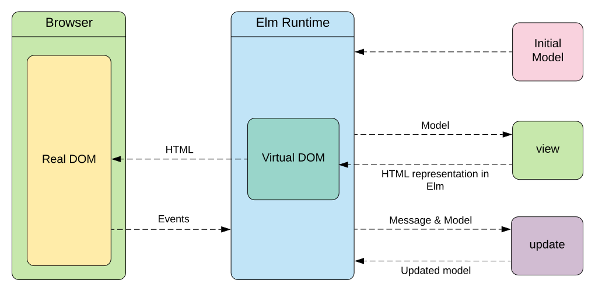

# 브라우저 랜더링 Browser Rendering Process

브라우저는 사용자가 선택한 자원을 서버에 요청하고 받아와 브라우저 엔진을 통해 보여준다. 크롬 웹킷(Webkit), 파이어폭스는 개코 (Gecko) 엔진을 이용한다.

`https://www.coupang.com` 을 검색하면 쿠팡 서버에 파일 요청해서 (DNS가 실제 서버에 어디에 있는지 알고 있어서 자동으로 연결) 리소스를 다운받는다. 웹 페이지는 HTML/CSS/Javascript 으로 구성되어 있다.

## DOM 트리 구조 생성

DOM(The Document Object Model)이란 HTML, XML 문서를 구조화된 표현으로 제공하여 스크립트, 프로그래밍 언어가 DOM 구조에 접근하여 사용할 수 있게 연결시켜준다. 표준 인터페이스로 제공한다.

DOM은 스크립트 언어를 통해 새롭게 생성하거나 수정할 수 있다. (DOM은 HTML과 자바스크립트를 이어주는 공간으로, 내가 작성한 HTML을 자바스크립트가 이해할 수 있도록 객체(object)로 변환한다.) [1)](https://www.howdy-mj.me/dom/what-is-dom/)

DOM은 node와 object로 구성되어 있다. Node란 각각의 개체 (p, b, br 등) 태그뿐만 아니라 텍스트, 속성까지 모든 것을 의미한다. Object는 생성하거나 수정할 수 있는 Property, Method, Event를 포함한다. (DOM은 자바스크립트로 해당 문서에 노드 추가, 삭제, 변경, 이벤트 처리, 수정 등을 가능케 하는 API를 제공한다.) [1)](https://www.howdy-mj.me/dom/what-is-dom/)

DOM은 트리 자료구조로 되어 있다.

&#x20;

서버에 요청한 리소스를 다운받아 랜더링 한다. DOM 트리 구축을 위해 HTML, CSS을 파싱(변환)한다.

1. 변환: 브라우저가 HTML에 정의된 인코딩(i.e. UTF-8)으로 문자열로 변환한다.
2. 토큰화: 브라우저가 문자열을 W3C 표준에 지정된 고유 토큰으로 변환한다.&#x20;
3. DOM 생성 : 마크업에 정의된 여러 태그 간의 관계를 해석해서 트리 구조 생성한다.

DOM과 CSSOM 생성 후 두개를 합쳐서 랜더트리를 생성한다.

## 레이아웃 Layout

뷰 포트 내에 각 노드들이 브라우저 화면에 어떤 위치에 어느 정도의 크기로 나타나야할지 정확하게 계산해서 박스모델로 노출한다. (크기, 위치, 색상 등의 스타일)

## 그리기 Painting

계산된 각 노드들을 화면에 실제로 그리는 작업을 진행한다.&#x20;

## 리플로우 Reflow

사용자에 의해 HTML이 새롭게 추가되거나, 수정되었을 때 영향을 받는 모든 노드가 랜더 트리 생성, 레이아웃 단계를 거친다.

(리플로우 대표적인 속성) position, width, height, margin, padding, border, border-width, font-size, font-weight, line-height, text-align, overflow

## 리페인트 Repaint

리플로우된 노드를 다시 화면에 그린다.

(리페인트만 일어나는 속성) background, color, text-decoration, border-style, border-radius&#x20;

## 가상 DOM Virtual DOM

다음과 같은 문제를 해결하기 위해 만들어졌다.&#x20;

* DOM 조작에 의한 랜더링의 비효율적인 문제&#x20;
* SPA(Single Application Page)의 복잡도 증가에 따른 최적화 및 유지보수의 어려움 [5)](https://jeong-pro.tistory.com/210)

가상 DOM은 여러 수정사항이 있어도 이전 상태와 비교해서 달라진 부분을 모아 한번만 real-DOM에 전달해서 한번 랜더링 된다. (`useState`과 같다.) 변경 사항을 **일괄 처리**하고 호출을 통해 **한 번에** 실제 돔에 적용한다. 따라서, 리플로우와 리페인트를 최소화한다. [8)](https://velog.io/@kim-jaemin420/reactVitual-Dom%EC%9D%B4%EB%9E%80-What-is-Virtual-Dom)

