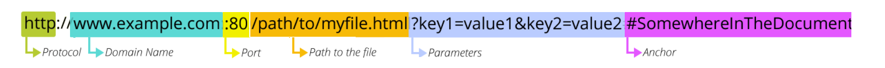

# 교차 출처 리소스 공유 CORS

CORS(Cross Origin Resource Sharing)는 브라우저에서 실행 중인 어플리케이션이 자신의 출처(도메인, 프로토콜, 포트 등)와 다른 출처의 자원에 접근할 수 있도록 교차 출처 HTTP 요청을 실행한다.

## URL 구조

### 프로토콜

* HTTP(Hyper Text Transfer Protocol) 프로토콜(규약)
* 웹에서 클라이언트와 서버가 어떤 방법으로 자원에 접근할 지 알려줌
* http/https 말고도 mailto, ftp 등 다양한 프로토콜 있음 [1)](https://hanseul-lee.github.io/2020/12/24/20-12-24-URL/)

### 도메인 Host

* IP 주소를 대신해서 사용하는 주소
* DNS(Domain Name System)/네 서버를 이용해서 IP와 도메인을 매칭 > DNS가 `coupang.com` 주소를 IP 주소로 변환
* &#x20;`example.com`  메인 도메인, `www` 는 서브 도메인

### Port

* http는 80번, https는 443번
* 포트는 옵셔널로 숨겨진다.

### 자신의 출처 Origin Resource

**프로토콜+도메인 이름+포트** `https://www.coupang.com:443`

이 중에서 하나라도 다르면 정책을 위반한다.

## CORS 장점

XSS, CSRF(XSRF) 보안 취약 방어

&#x20;
