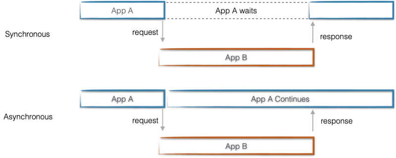

# 목록

## 브라우저 동작원리

1. 유저가 브라우저에 입력한 주소는 DNS 서버에서 실제 해당 서버가 위치한 곳으로 연결
2. 실제 서버에서 HTML/CSS/JS 리소스 다운로드
3. HTML/CSS를 파싱해서 HTML은 DOM 트리, CSS는 CSSOM 트리를 생성
4. 생성한 두개의 트리를 합쳐 랜더트리를 생성
5. 생성된 랜더트리의 각 노드들을 계산해서 위치, 크기 등과 같은 레이아웃을 만듦
6. paint 단계에서 각 노드들을 실제 화면에 그림

유저가 이벤트를 발생시켜 새로운 노드가 추가되거나 변경된다면 reflow, repaint가 일어난다. 많은 reflow와 repaint가 일어나게 되면 성능상 이슈가 발생한다. 많이 발생하지 않도록 최적화 시켜야한다.&#x20;


**최적화 방법** [**1)**](https://beomy.github.io/tech/browser/reflow-repaint/)****

* 불필요한 태그 사용은 지양하고 최소한의 태그 사용으로 작게 만든다.
* 애니메이션의 경우 초당 프레임이 지속적인 reflow를 발생시키기 때문에 퀄리티와 퍼포먼스에서 타협점을 찾는다.
* 변경이 필요한 경우, 가장 하위 노드에 적용하면 reflow 영향을 최소화 할 수 있다.


| Reflow                                                | Repaint                                                                         |
| ----------------------------------------------------- | ------------------------------------------------------------------------------- |
| `position`, `width`, `height`, `margin`, `padding` 등  | `background`, `color`, `box-shadow`, `border-radius`, `outline`, `visibility` 등 |


## CORS(Cross-origin Resource Sharing)

<figure><figcaption><p>URL <a href="https://developer.mozilla.org/en-US/docs/Learn/Common_questions/What_is_a_URL">2)</a></p></figcaption></figure>

교차 출처 리소스 공유는 동일한 URL이 아닌 다른 출처에서 데이터를 주고 받는 것을 허용하는 정책이다.&#x20;

**프로토콜**, **호스트**, **포트**가 모두 같아야 동일한 출처이다.


실제로 리액트 프로젝트를 하면서 CORS 이슈를 겪었는데, 이를 해결하기 위해 `package.json` 에서 `proxy` 설정으로 해결했다.

```javascript
//package.json

"proxy": "http://localhost:8888"
```

<figure><figcaption><p>Proxy 동작 원리</p></figcaption></figure>

##

## CSR(Client Side Rendring) SSR(Server Side Rendering)

**CSR 동작**

1. 서버에서 HTML/CSS 리소스 다운 후 빈 HTML 노출
2. JS 다운로드
3. 동적으로 DOM 생성
4. 유저 인터렉션 가능

**SSR**

1. 서버에서 만들어진 HTML 파일을 다운로드 후 완성된 화면 노출
2. JS 다운로드
3. 유저 인터렉션 가능


| 항목            | CSR                          | SSR                            |
| ------------- | ---------------------------- | ------------------------------ |
| **페이지 구성 방식** | SPA(Single Page Application) | MPA(Multiple Page Application) |
| **페이지 로딩 시간** | 초기 로딩 느림 이후 TTV, TTI 갭 없음    | 초기 로딩 속도 빠름, 페이지 로딩 시 깜빡임      |
| **SEO 대응**    | 빈 HTML로 SEO 불리               | 완성된 HTML로 SEO 유리               |
| **서버 자원 사용**  | 서버 부하 적음                     | 서버 부하                          |
| **애플리케이션**    | 인터렉션이 많은 애플리케이션              | 커머스, 신문 등                      |

진행했던 프로젝트는 커머스 비즈니스이기 때문에 SEO가 중요한 플랫폼이고 이를 위해 Next.js를 도입했다.


## REST API

REST(Representational State Transfer)는 서버와 통신할 때의 만든 하나의 인터페이스이다. 일관적인 인터페이스를 유지할 수 있다. 자원 기반으로 설계되기 때문에 말하려는 바를 메시지를 통해 쉽게 알 수 있다. 다만 HTTP Method가 한정적인 단점도 있다.

* 자원 Resource -> HTTP URI(Uniform Resource Identifier)
* 행위 Verb -> HTTP Method(POST, GET, PUT, DELETE)을 통해 자원의 CRUD 기능을 수행할 수 있다.
* 표현 Representations -> HTTP Message Pay Load

```
GET api/team
GET api/team/:id
POST api/team
PUT api/team
DELETE api/team
```

소문자로만, 하이픈(-)으로, 마지막에는 슬래시(/) 없이 그리고 행위를 포함하지 않는 방식 등으로 설계되어야 한다.&#x20;


**\*URI vs URL**

<figure><figcaption><p>URI vs URL <a href="https://danielmiessler.com/study/difference-between-uri-url/">3)</a> </p></figcaption></figure>


## 브라우저 저장소

두 저장소 `key: value` 형태의 문자열 string 값으로 저장한다.


**Cookie**

Cookie는 4KB로 작은 데이터를 저장할 수 있고, 서버와 통신한다. 쿠키는 주로 서버가 유저를 기억하기 위한 용도로 사용된다. HTTP 프로토콜은 stateless이기 때문에 `request > response`가 끝나고 나면 통신을 끊고 그 다음 통신을 해도 이전 내용을 기억할 수 없기 때문이다. (주로 사용자의 언어, 다크모드 등의 내용을 저장)


**Web Storage**

Web Storage는 Local, Session으로 나뉘어져 있다. 5MB 정도로 쿠키에 비해서 큰 데이터를 저장 할 수 있고, 서버로 전송되지 않는다. 굳이 서버로 전송할 필요가 없는 데이터라면 보안과 속도를 위해 이용하며, 웹 성능에 영향을 주지 않고 큰 데이터를 저장할 수 있다. **Local Storage**는 유효기간이 없지만, **Session Storage**는 창을 닫으면 초기화된다.   [4)](https://geonlee.tistory.com/127)

실제로 프로젝트에서도 Local Storage를 사용했었고, 일회성 모달과 로그인 여부를 확인하기 위해 저장했다.


**Browser Cache**

Browser Cache는 브라우저에서 웹 리소스의 사본을 저장하는 방식으로 이미지, HTML, CSS, JS 등의 에셋이 있다. 서버와 클라이언트가 통신을 하다보면 지연될 수 있고 이 간극을 줄이기 위해 브라우저 캐시가 있다.&#x20;


## attribute, property

```html
<input value="name" />
```

태그 내 속성을 의미하는 `attribute`

DOM은 객체로 이루어져있기 때문에 생성 후 그 안에 속성은 `property` , DOM을 조작해 `property`를 변경할 수 있다.&#x20;


## inline, inline-block, block, Box Model

<figure><figcaption><p>Box Model</p></figcaption></figure>

`inline`은 실제 컨텐트의 크기 만을 의미한다.&#x20;

`inline-block`은 `margin`과 `padding` 속성에서 상하에만 적용된다. `width`, `height`는 적용되지 않는다. 그렇기 때문에 옆에 컨텐트가 붙을 수 있다.

`block`은 한 줄을 다 차지한다. `width`, `height`, `margin`, `padding` 모든 것이 적용된다.


컨텐트의 영역은 `content+padding`으로 `background`, `img` 등의 요소들이 해당 영역까지 반영된다.


## Javascript, Sync vs Async

자바스크립트는 **논 블로킹**, **싱글 스레드** 언어이다. 또한, 선언이 아닌 변수에 할당되면서 데이터의 타입이 결정되기 때문에 동적 타입이고, 스크립트언어로 한 줄씩 읽어가며 오른쪽에서 왼쪽으로, 위에서 밑으로 진행된다.

싱글 스레드이지만 하나의 작업이 완료되기를 기다리지 않고 다음 작업을 수행할 수 있다. 이렇게 **비동기처리**가 가능하기 때문에 논 블로킹이라 부른다.


<figure><figcaption><p>Sync vs Async <a href="https://www.linkedin.com/pulse/sync-async-connectivity-explained-zolt%C3%A1n-simon?trk=read_related_article-card_title">4)</a></p></figcaption></figure>
