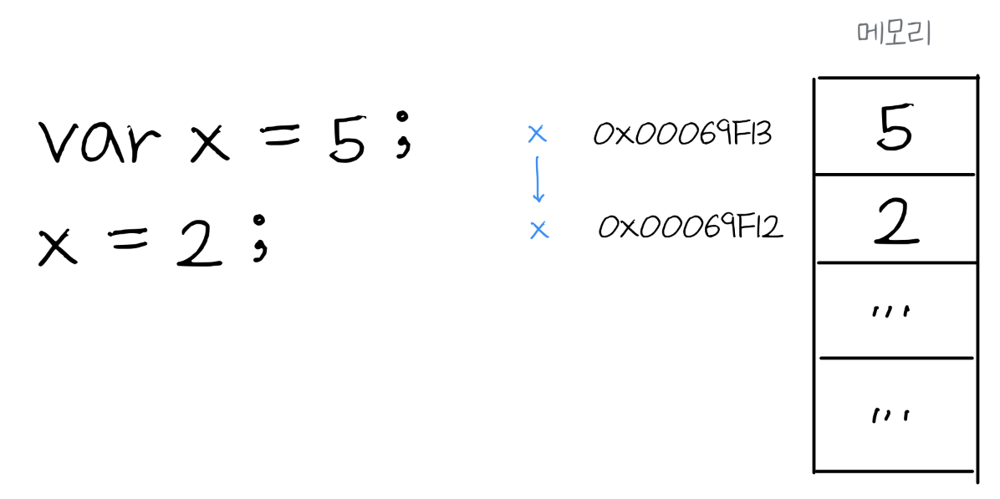

# 변수 Variable

변수란 데이터를 관리할 수 있는 방법이다. 데이터는 메모리 힙 Memory Heap 임의의 위치에 저장되고 저장된 데이터의 주소 값을 변수가 기억하고 있다. 변수를 사용할 때는 변수가 기억하고 있는 메모리 주소에서 데이터를 불러와 변수에 할당한다. 할당 할 때는 데이터 타입에 따라 `call by value`, `call by reference` 두가지 방식으로 처리한다.

## 식별자 Identifier


* `value` 는 메모리 주소에 값이 담겨있는 위치를 구분하기 위해 붙힌 이름
* `value` 식별자는 메모리 주소를 기억

## 변수 선언, 초기화 그리고 할당 Variables Life Cycle

자바스크립트의 변수는 `var`, `let`, `const` 총 3가지 방법으로 선언할 수 있다. 변수를 선언해야하는 이유는 메모리 공간을 확보하는 것이고, 확보해야 데이터를 저장할 수 있기 때문이다. 이렇게 변수를 선언하게 되면 프로그램을 실행되기 전에 메모리를 효율적으로 관리하기 위하여 선언한 변수의 초기화를 진행하며 메모리 공간을 확보한다. 즉, 변수에 실제 값을 할당하기 전에 변수 `var`의 경우 `undefined` 값을 할당하여 메모리 공간을 확보한다. 이를 호이스팅 Hoisting이라고 하며 변수와 함수 등이 호이스팅 될 수 있다.

`var`, `let`, `const`는 각각 다른 방식으로 선언, 초기화 그리고 할당이 진행된다.&#x20;

### var

```javascript
console.log(foo); //undefined
var foo = 10;
foo = 20;
---------------------------------
//Hoisted
var foo; //declaration
foo = undefined; //initialization
---------------------------------
console.log(foo); //undefined
foo = 10; //assignment
foo = 20; //re-assignment
```

`var`는 선언과 동시에 초기화가 일어난다. 그렇기 때문에 선언 전에 참조해도 호이스팅을 통해 초기화 일어나 `undefined` 값이 있기 때문에 에러가 발생하지 않는다. 또한 `var`는 재할당이 가능하다.

### const

```javascript
console.log(foo); //ReferenceError: foo is not defined
const foo = 10;
foo = 20; //TypeError: Assignment to constant variable.
-------------------------------------------------------
//Hoisted
const foo; //declaration
//TDZ scope start
-------------------------------------------------------
console.log(foo); //
//TDZ scope end
foo = 10; //assignment
foo = 20; //TypeError: Assignment to constant variable.
```

`const`는 호이스팅을 통해 선언은 일어나지만 초기화가 진행되지 않았기 때문에 메모리에 할당되지 않아 에러가 발생한다. 그 이유는 `const`는 초기화와 동시에 값이 할당되기 때문에 초기화+할당 전까지 TDZ 스코프에 해당된다. TDZ 스코프에 있을 때에는 참조할 수 없기 때문에 에러가 발생한다. 또한 `const`는 재할당이 불가능하다.

```javascript
console.log(foo);
const foo; //SyntaxError: Missing initializer in const declaration
```

`const`는 선언과 동시에 값을 할당해야 한다.

## 데이터 타입


## 원시타입 Primitive Type

```javascript
var x = 5 
// Number, String, Boolean, null, undefined, Symbol
```

<figure><figcaption><p>Immutable value</p></figcaption></figure>

* 원시 값은 변경 불가능(Immutable value)
* 메모리 주소를 변경해서 값을 변경, 원천 데이터는 변경할 수 없음

###

## 객체/참조타입 Object/Reference Type

```javascript
const arr = [1, 2, 3]; 
// Object
```

`arr`은 재할당 불가능한 변수 값의 주소를 재할당할 수 없으나, 주소 안의 값은 변경할 수 있다.

###

## 스코프 Scope

```javascript
var a = 100;
if (a>0) {
    var a = 200;
    console.log(a); //200
}
console.log(a); //200

let b = 100;
if(b>0) {
    let b = 200;
    console.log(b); //200
}
console.log(b); //100

```

`let`은 함수와 같은 블록 내 스코프를 가진다.
