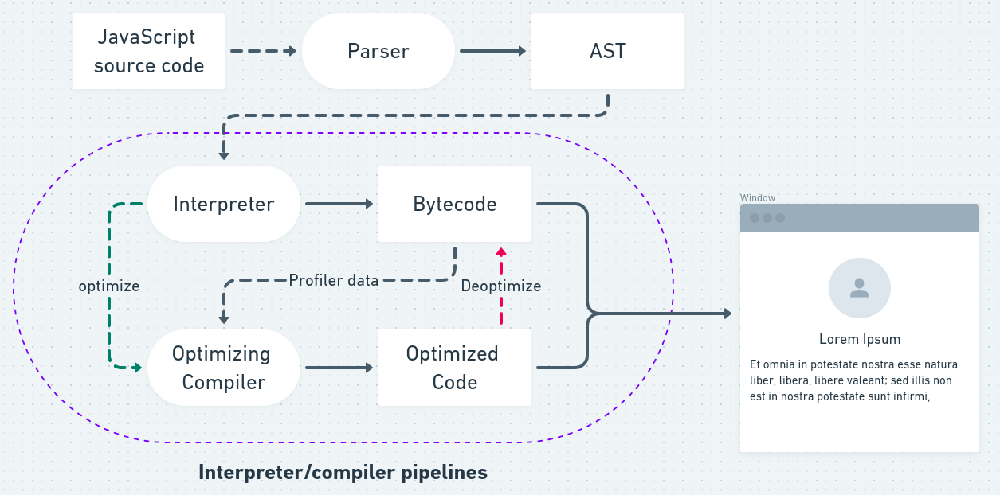

# 자바스크립트란 What is JavaScript

<figure><figcaption><p>CS 50 2019 C <a href="https://www.youtube.com/watch?v=e9Eds2Rc_x8&#x26;list=PLhQjrBD2T381L3iZyDTxRwOBuUt6m1FnW&#x26;index=2">1)</a></p></figcaption></figure>

우리가 작성하는 코드들은 기계가 이해할 수 없다. 기계는 전기가 통하는지/안통하는지로 이해하기 때문에 작성한 코드를 기계가 이해할 수 있도록 변환하는 과정이 필요하다. 이는 **컴파일러**를 통해 변환할 수 있다.

## 자바스크립트는 컴파일러가 필요한가?

> 예전에 비해 복잡하고 더 많은 인터렉션을 필요로 하는 애플리케이션이 증가함에 따라 상황에 따라 자바스크립트는 컴파일러가 작동한다.

컴파일러를 거치는 경우 Compiled language라 부르며, 자바스크립트는 Interpreted language 또는 JIT(Just-in-time) compiled language라고 한다. [2)](https://developer.mozilla.org/ko/docs/Web/JavaScript) 자바스크립트는 필요에 따라서 엔진에서 컴파일 과정을 거친다.

구글맵스를 구동시킬 수 있는 V8 엔진을 만들면서 자바스크립트는 컴파일 과정도 거치게 되었다. 컴파일 과정을 거치게 되면 코드를 최적화하고 빠르게 구동시킬 수 있는 특징이 있다. 자바스크립트는 인터프리터를 통해 한줄 한줄 읽어나가면 바로 실행할 수 있기 때문에 **기존 인터프리터의 특징을 유지하면서 컴파일 과정을 추가**해 고성능 자바스크립트 실행기가 되었다.

<figure><figcaption><p>Javascript Compilation <a href="https://devlog-of-yein.tistory.com/6">3)</a></p></figcaption></figure>


## 동적 타입 Dynamic typing

자바스크립트는 한줄 한줄 읽어나가면서 바로 실행되는 인터프리터 언어이다. 그렇기 때문에 실행될 때 변수의 타입이 결정된다. 동적 타입은 유연한 개발을 할 수 있지만, 예상치 못한 타입으로 인해 오류가 발생할 수 있다.&#x20;

```javascript
const foo = 1 + "0"; //10
```

타입스크립트를 이용하게 되면 `foo`는 `number + string`이기 때문에 타입 에러가 난다. 그러나 자바스크립트는 `1`을 `string`으로 변경해서 연산을 진행한다.&#x20;


## 싱글 스레드 Single Thread

자바스크립트는 실행하는 작업 공간이 하나인 싱글 스레드이다. 즉, 한줄 한줄 읽어나가면 하나의 작업이 완료될 때까지 기다렸다가 다음줄에 있는 작업을 진행한다. 이를 블로킹 Blocking 또는 동기 Synchronous이라고 한다.

#### 왜 자바스크립트는 논블로킹 Non-blocking이 가능한가?

비동기처리가 가능하기 때문이다. 비동기 Asynchronous라 하면 하나의 작업이 완료되기 전에 다음 작업을 진행할 수 있는 방식이다.&#x20;

웹 브라우저에서 제공하는 AJAX, setTimeout 등의 [Web API](https://developer.mozilla.org/en-US/docs/Web/API)의 비동기 작업을 처리할 수 있는 이벤트 루프와 태스크 큐가 있다. 이벤트 루프를 통해 작업을 진행하는 콜 스택이 비어있을 때 비동기 작업을 태스크 큐에서 이벤트 루프가 꺼내와서 처리한다.&#x20;

#### Macro Queue

* setTimeout
* setInterval
* ...

#### Micro Queue

* Promise
* async
* ...
