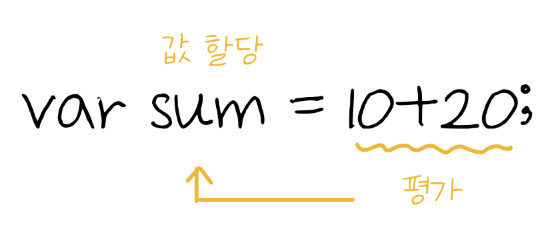
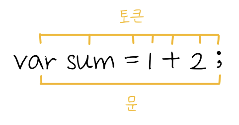

# 표현식과 문 Expression & Statement

### 표현식

&#x20;

값은 표현식이 평가되어 생성된 결과 (평가란 표현식을 해석하거나 값을 생성하거나 참조하는 것)

\*`오른쪽 > 왼쪽`, `위 > 아래`로 읽어나가기 때문에 오른쪽에서 값을 평가해서 부등호를 기준으로 왼쪽에 있는 변수에 할당


```javascript
10+20; //평가 된 값은 30
```


### 표현문



문이란 최소 실행 단위 또는 프로그램을 구성하는 기본 단위

예시) 변수 선언문, 할당문, 함수 선언문, 조건문 등...



식과 문이 헷갈린다면 변수에 할당해보고 할당이 가능하면 식, 불가능하면 문

