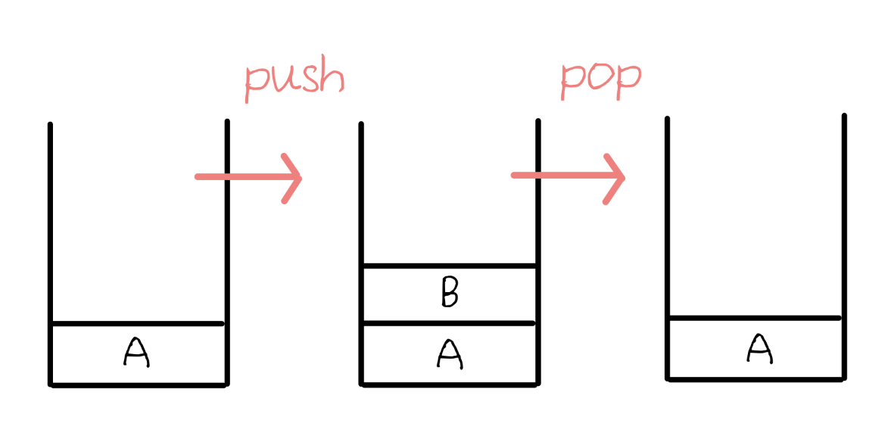
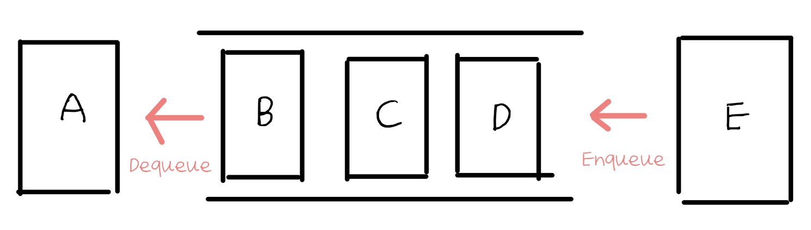

# 스택과 큐 Stack & Queue

### 스택 Stack

<figure><figcaption>
LIFO (Last in First Out)
</figcaption></figure>

Push로 가장 마지막에 데이터 넣고 (B 추가)

Pop으로 가장 마지막에 넣은 데이터 꺼냄 (B 꺼냄)

### 큐 Queue

<figure><figcaption>
FIFO (First in First Out)
</figcaption></figure>

Push(Enqueue)로 가장 마지막에 데이터 넣고 (E 추가)

Shift(Dequeue)로 가장 먼저 밀어넣은 데이터 꺼냄 (A 꺼냄)

###
