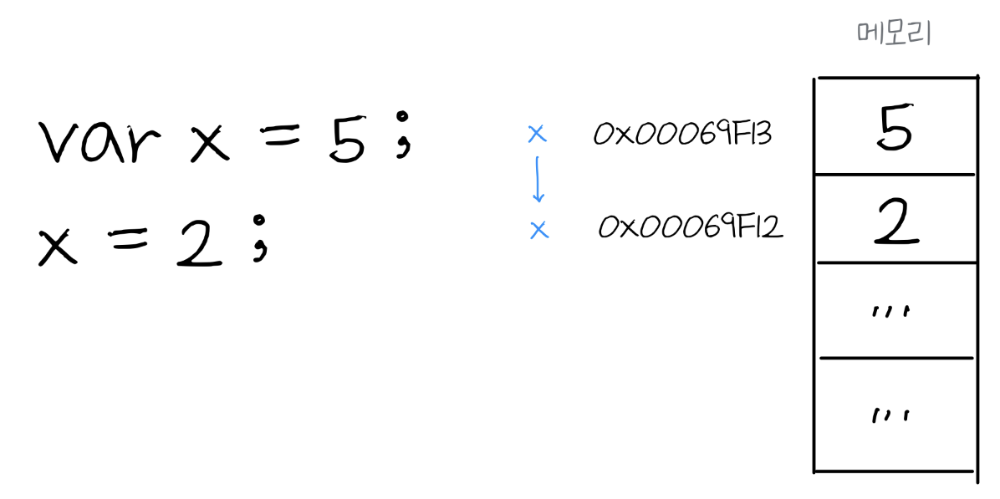

# 변수 Variable

변수란 데이터를 관리할 수 있는 방법이다. 데이터는 메모리 힙 Memory Heap 임의의 위치에 저장되고 저장된 데이터의 주소 값을 변수가 기억하고 있다. 변수를 사용할 때는 변수가 기억하고 있는 메모리 주소에서 데이터를 불러와 변수에 할당한다. 할당 할 때는 데이터 타입에 따라 `call by value`, `call by reference` 두가지 방식이 있다.

## 식별자 Identifier


* `value` 는 메모리 주소에 값이 담겨있는 위치를 식별하기 위해 붙힌 이름
* `value` 식별자는 메모리 주소를 기억

## 변수 선언과 할당 Variables Life Cycle


## 데이터 타입


## 원시타입 Primitive Type

```javascript
var x = 5 
// Number, String, Boolean, null, undefined, Symbol
```

<figure><figcaption><p>Immutable value</p></figcaption></figure>

* 원시 값은 변경 불가능(Immutable value)
* 메모리 주소를 변경해서 값을 변경, 원천 데이터는 변경할 수 없음

###

## 객체/참조타입 Object/Reference Type

```javascript
const arr = [1, 2, 3]; 
// Object
```

`arr`은 재할당 불가능한 변수 값의 주소를 재할당할 수 없으나, 주소 안의 값은 변경할 수 있다.

###

## 스코프 Scope

```javascript
var a = 100;
if (a>0) {
    var a = 200;
    console.log(a); //200
}
console.log(a); //200

let b = 100;
if(b>0) {
    let b = 200;
    console.log(b); //200
}
console.log(b); //100

```

`let`은 함수와 같은 블록 내 스코프를 가진다.
