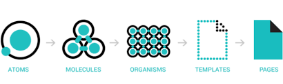

# Concepts

리액트는 컴포넌트들의 집합체이다. 컴포넌트라 하면 UI(User Interface)로 자신의 로직과 스타일을 갖고 있다. 예를 들면 아주 작은 단위의 버튼부터 하나의 페이지까지 다양하다.

<figure><figcaption>
Atomic design system <a href="https://blog.prototypr.io/what-is-this-thing-atomic-design-i-keep-hearing-about-3b7bd0edddcd">1)</a>
</figcaption></figure>

\-> React는 Atomic design system과 잘 부합하는 것 같다.

리액트 컴포넌트는 자바스크립트의 함수를 사용하며 마크업을 반환한다. HTML 태그와 구분할 수 있도록 리액트 컴포넌트는 대문자를 사용한다.&#x20;
