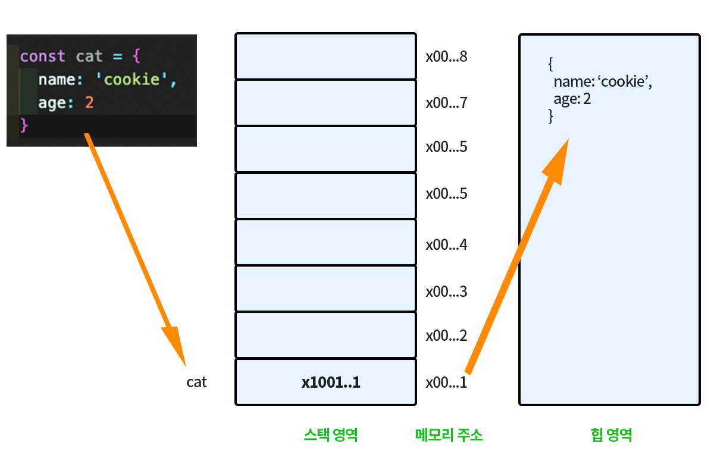

# 상태의 불변성 State Immutability

### 자바스크립트 타입 Javascript type

> **Primitive type**
>
> Number, String, Boolean, null, undefined, Symbol

> **Object type**
>
> Object, Array, Function, Date, RegExp, etc.,

자바스크립트는 크게 두 가지 타입 그룹을 갖고 있으며 각각 `원시타입 Primitive type` 과 `객체타입 Object type`이다. 자바스크립트에서 모든 값은 메모리의 주소를 참조하는 형태이다. 다만 그 안에 값이 원시 형태인지, 객체 형태인지에 따라 구분이 된다.

변수에서 값을 변경하는 방법은 다른 메모리에 저장하고 변경된 메모리 주소로 레퍼런스를 변경해주는 것이다. 원시타입은 동일한 방법으로 스택에 저장된 값을 변경할 수 있고 객체는 힙에 저장된 값을 변경하기에 기존 객체 메모리 주소는 동일하다. 자세한 내용은 [변수](https://vlog.ireneworks.com/javascript/variable#identifier)에 대한 글을 참조하길 바란다.

<figure><figcaption>
Object type in memory <a href="https://ji-u.tistory.com/21">1)</a>
</figcaption></figure>

***

### Call by value, Call by reference

<figure><figcaption>
Call by value vs call by reference <a href="https://press.rebus.community/programmingfundamentals/chapter/call-by-value-vs-call-by-reference/">2)</a>
</figcaption></figure>

| Primitive Type                                         | Object Type                                                                        |
| ------------------------------------------------------ | ---------------------------------------------------------------------------------- |
| Call by Value                                          | Call by Reference                                                                  |
| <ul><li>호출되면 값을 복사해서 사용</li><li>사용되는 메모리 늘어남</li></ul> | <ul><li>호출되면 직접 참조해서 사용</li><li>직접 참조하기 때문에 원본이 변경 가능, 때문에 모든 참조가 영향을 받음</li></ul> |

원시타입의 경우 call by value로 직접적으로 해당 값을 복사해서 사용할 수 있다면, 객체타입의 경우 해당 메모리 내에 heap 내 참조할 메모리 주소를 갖고 있기 때문에 call by reference 라고 한다.

### 리액트에서의 상태

리액트에서는 상태 변경 여부에 따라서 랜더링을 진행한다. 그렇기에 리액트에서 상태는 굉장히 중요한 요소이다.&#x20;

값을 비교할 때는 얕은 비교 Shallow comparison을 사용한다. 얕은 비교를 하기 때문에 값의 레퍼런스의 변경 여부만을 확인하고 변경이 일어났다고 판단되면 랜더링을 진행한다.

#### 불변성 Immutable

리액트에서 불변성은 중요한 개념이다. 상태가 불변성을 유지해야 변경 유무를 파악하고 랜더링을 진행할 수 있다. 즉, 메모리에 저장된 값이 변하지 않고 다른 메모리에 값이 저장되어야 변경되었음을 알 수 있고 그렇기에 랜더링 할 수 있기 때문에 무엇이 달라졌는지 파악할 수 있어야한다.

불변성이라하면 메모리에 저장된 값은 변하지 않는 것을 이야기한다. 비교할 이전 상태가 변경되지 않아야 새로운 상태와 비교할 수 있기 때문이다. 그래서 객체인 경우 기존 state에 변경을 해도 변경됨을 알 수 없기 때문에 새로운 객체로 만들어 전달해야하며 대체로 많이 쓰이는 방법이 spread 연산자이다.
