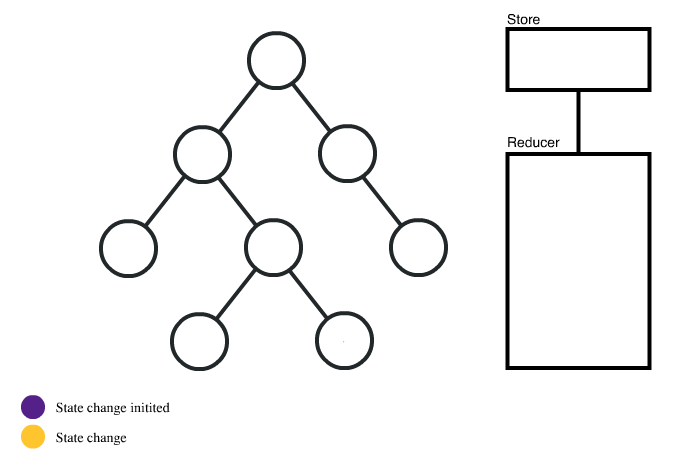

# 왜 리덕스를 사용할까 Why Redux

<figure><figcaption><p>MVC Pattern <a href="https://stackoverflow.com/questions/29594105/mvc-is-it-model-to-view-or-controller-to-view">1)</a></p></figcaption></figure>

```
Model -> State
View -> Components
Controller -> Logics in components
```

<figure><figcaption><p>Problem of MVC Pattern</p></figcaption></figure>

React의 경우 단방향 데이터 흐름을 갖고 있다. 다만 컴포넌트 안에 컴포넌트와 같이 nested 구조로 설계를 하다보면 다양한 상태 값들을 관리하기가 쉽지 않다. 자식 컴포넌트까지 상태 값을 내려주거나, 다양한 곳에서 상태 값을 업데이트하기 어려울 수 있다.

<figure><figcaption><p>React Props Drilling Problem <a href="https://medium.com/dailyjs/when-do-i-know-im-ready-for-redux-f34da253c85f">2)</a></p></figcaption></figure>


<figure><figcaption><p>Redux Usage <a href="https://medium.com/dailyjs/when-do-i-know-im-ready-for-redux-f34da253c85f">2)</a></p></figcaption></figure>

Redux를 이용하여 하나의 Store를 두고 필요한 컴포넌트에서 바로 State를 참조하며, 필요한 곳에서 상태 값을 업데이트 할 수 있다. 관심사를 분리하여 상태를 업데이트 하는 Reducer(dispatch, action)를 한 곳에 모았다.
