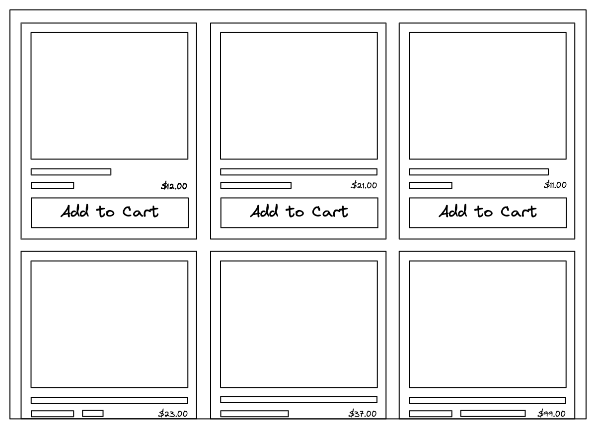
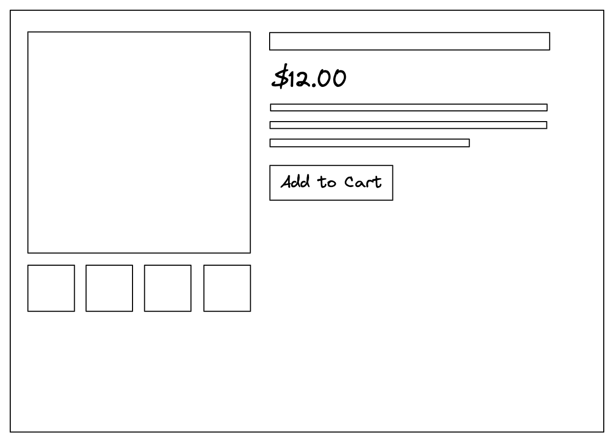
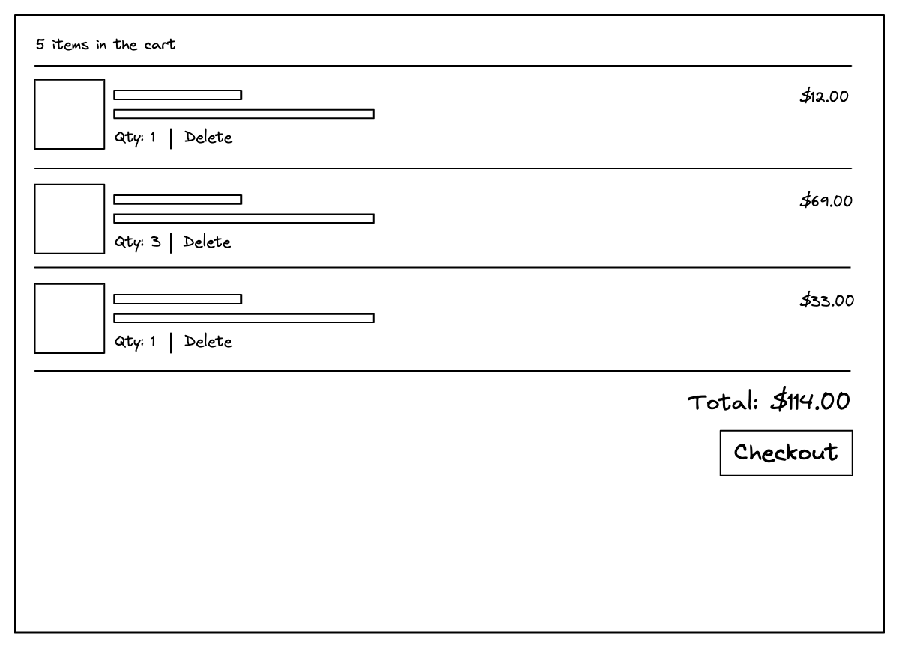
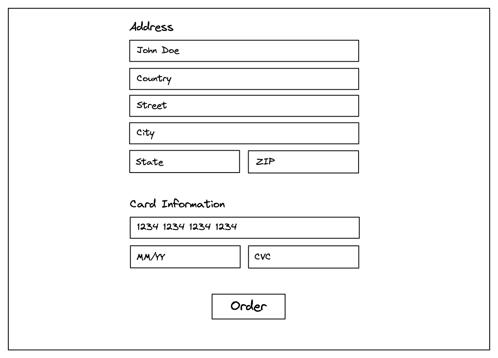

# E-Commerce Marketplace

### Question

Design an e-commerce website that allows users to browse products and purchase them.

### Requirements

browse products and purchase를 충족 할 수 있는 요구사항으로 작성해야한다.

1. Product list page & product detailed page (PLP\&PDP)

**PLP**

<figure><figcaption>
PLP
</figcaption></figure>

* SEO를 통해 유저가 쉽게 외부에서 진입할 수 있어야한다.
  * SSR을 통해 SEO를 최적화하며 적절히 CSR을 사용하여 하이브리드 구성
* 유저는 쉽게 원하는 상품을 찾을 수 있어야한다.
  * 유저는 쉽게 상품을 비교할 수 있어야한다.
    * order(sort), filter, 상품 정보
    * 상품 DB 구성
      * 브랜드, 카테고리, 상품 옵션 등 SKU ERD 설계
  * 유저는 쉽게 원하는 상품을 검색할 수 있어야한다.
    * autofill, 검색 결과
  * 페이지네이션
    * 무한 스크롤 vs 페이지네이션
* 광고 및 넛지

**PDP**

<figure><figcaption>
PDP
</figcaption></figure>

* 옵션 노출

2. Cart

<figure><figcaption></figcaption></figure>

3. Checkout

<figure><figcaption></figcaption></figure>


